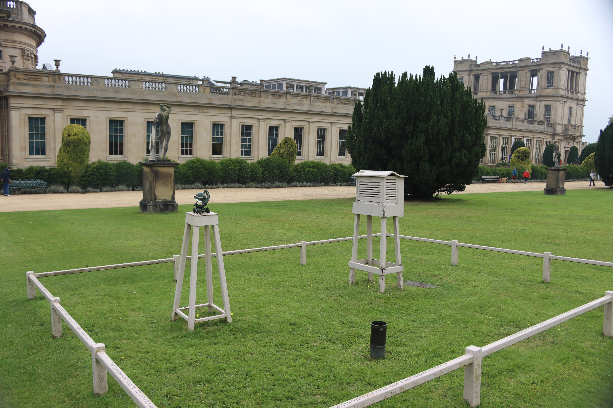
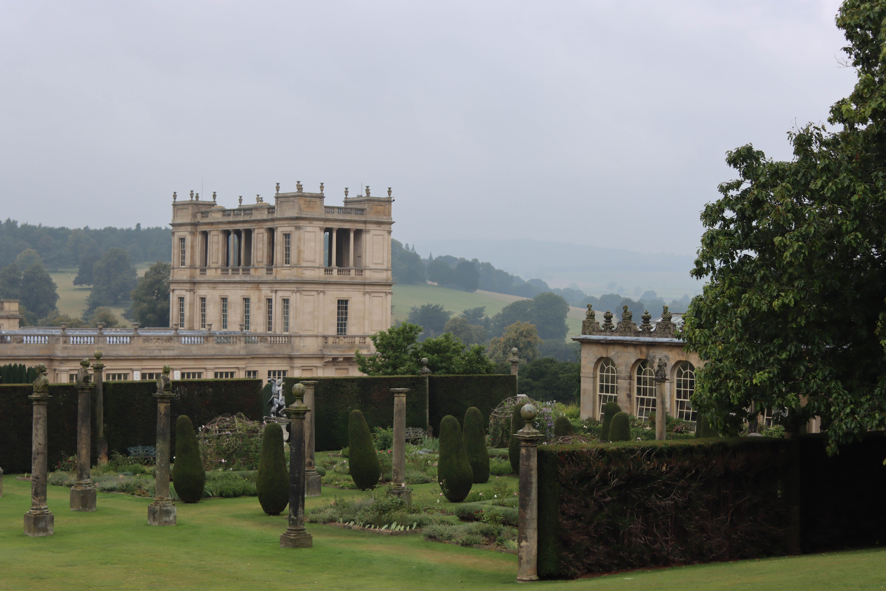
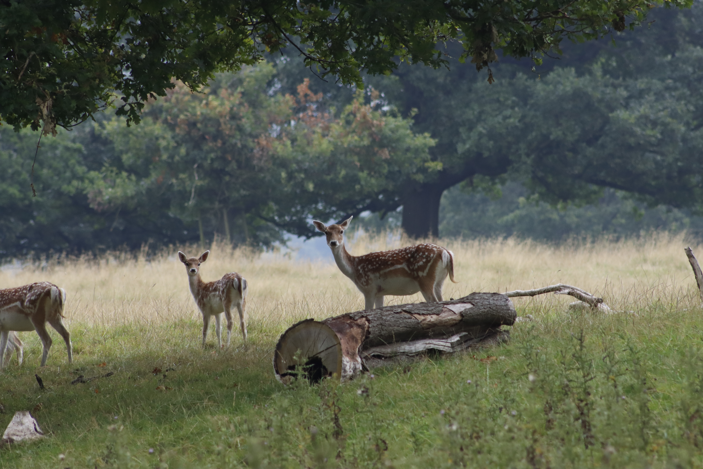
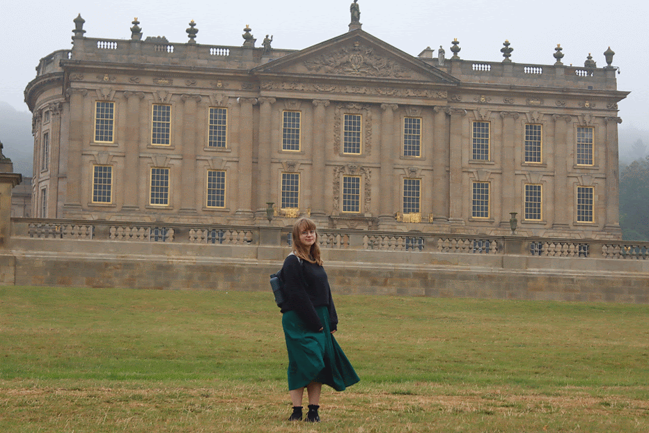

---
authors:
  - James
date: 2025-05-24
---
# Camping in the Peak District - Sept 2024
## Day 0 - Setting Up Camp
We arrived on Friday evening after work to set up the tent at [Dale Farm Rural Campsite](https://maps.app.goo.gl/JReTpgvXy4t3wz5W8), a lovely little campsite not far from Bakewell. 
<iframe src="https://www.google.com/maps/embed?pb=!1m18!1m12!1m3!1d2387.38490760889!2d-1.7110993232745102!3d53.24680157226059!2m3!1f0!2f0!3f0!3m2!1i1024!2i768!4f13.1!3m3!1m2!1s0x487a28d927066ec9%3A0x2e80ffa967c8e6ad!2sDale%20Farm%20Rural%20Campsite!5e0!3m2!1sen!2suk!4v1748464149362!5m2!1sen!2suk" width="600" height="450" style="border:0;" allowfullscreen="" loading="lazy" referrerpolicy="no-referrer-when-downgrade"></iframe>

## Day 1 - Chatsworth House & Bakewell
The next morning we headed straight to [Chatsworth House](https://www.chatsworth.org/) and spent a good few hours having an amble about the place. It's particularly known for this room, the Painted Hall: 

Which excelled at giving everyone there neck ache. The house itself offered all the grandeur, history, pomposity, and middle class jealousy that all typical English estate houses do. Below are some of my favourite bits. Mostly outside - apparently the garden is maintained by 20 gardeners, 3 trainees and 50 volunteers!

/// caption
I wish all lifts looked like this!
///

/// caption
There's something oddly satisfying about weather stations. This one's been going for AGES, according to [this blog post](https://blogs.nottingham.ac.uk/weatherextremes/2014/09/05/getting-into-the-archive-weather-and-the-great-estate-the-recording-of-rainfall-at-chatsworth-house-derbyshire-1760-to-the-present/) by James Bowen of the University of Nottingham, "The weather is still recorded daily at 9am by a gardener at Chatsworth, and this data is accessible through ‘The British Atmospheric Data Centre’ (BADC) from 1878 to the present."
///

/// caption
A panoramic view from just below the [cascade](https://cascade.chatsworth.org/). 
///

/// caption
Loads of deer all over the grounds!
///

After walking around the grounds, for a long while, we embarked on a trip to the town of Bakewell:

/// caption
Our roughly 15km walk to Bakewell and back. GPX route [here](../../assets/From_Chatsworth_House_to_Bakewell_and_back.gpx).
///

It was a wet walk, but good fun. The grass was longer and wetter than expected though, so we were squelching along with our feet swimming in our boots. Of course we treated ourselves to a Bakewell tart and a Bakewell pudding, the latter of which I'd never heard of before - maybe they just get sold to weary hungry tourists with wet feet.

## Day 2 - Poole's Cavern

/// caption
The morning view from our spot on the campsite. I like how the mist is meandering through the hills. 
///

Having done enough exploring above ground, we decided to spend some time below ground in Poole's Cavern. 

:fontawesome-solid-hourglass-half: This page has yet to be completed. Come back later :fontawesome-regular-face-smile-beam: