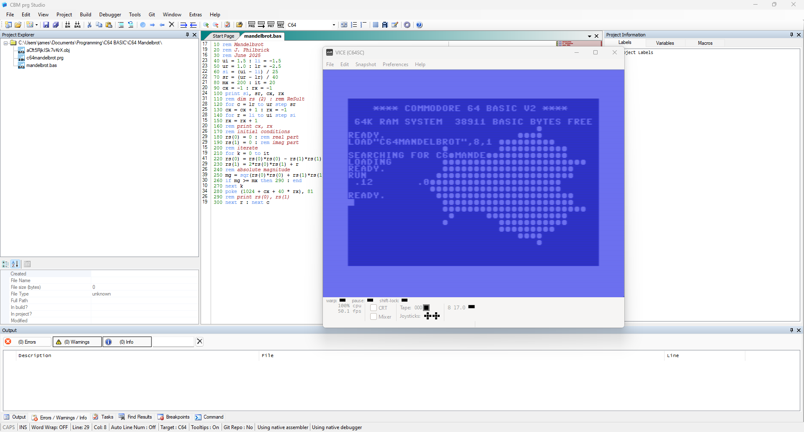

# Mandelbrot Set on the Commodore 64
[:material-arrow-left: Projects](projects.md)

## Overview
The [Mandelbrot set](https://en.wikipedia.org/wiki/Mandelbrot_set) is... 
## Development
I first sat down with my physical C64 to learn how to use it and read up on the basics of BASIC. Something about reading the physical manual in my hand which had been type-set in the early '80s was really satisfying. Limiting myself to just the one resource in front of me, without googling a whole lot and jumping from site to site every time I needed to learn a new piece of syntax, was quite refreshing; it forced me to really *read* the manual and experience the charm of all its hand-drawn figures and its dated simplicity.

After tapping away at my breadbin for a while, I decided to power it down and jump on to my windows 11 PC to start developing the program using a modern IDE and emulator, for a couple of reasons:

1. ...nice ide w/ automatic re-numbering
2. can speed up the emulator

My first attempt at the program was to use the standard screen resolution and use `PEEK` and `POKE` to fill the character ● for values in the set. This is in the same vein as the [first published image](assets/Pasted%20image%2020250614145340.png). 

Here's my first running program that (didn't give me any memory errors): 


Note that this is sped up to about $10\times$ native speed using the emulator. This is the setup: 


This issue is that while this works, it's lacking enough resolution to really show off its fractal-like nature. In fact the resolution is so low that, while charmingly retro, it alters the shape's characteristics. Here's the same iteration of the program, with different bounding values for the imaginary and real axes: 


I'm sure you'll agree that the shape *looks* different. 

Amongst the many [graphics modes available](https://www.studiostyle.sk/dmagic/gallery/gfxmodes.htm) to the C64 is the `Standard High-Resolution Bit Map Mode` which allows for a $320\times200$ dot resolution, with each dot being directly controllable (boolean on/off). I think we can all agree that a this'll give a much-needed upgrade to the clarity of the image, and will greatly contrast the measly $40\times25$ "pixel" image I've generated so far. 

So I read (skimmed) a few pages from the [graphics manual (1983)](https://www.commodore.ca/manuals/c64_programmers_reference/c64-programmers_reference_guide-03-programming_graphics.pdf) , and found that the following commands are essentially what it's all about:

```basic
POKE 53265, PEEK(53265) OR 32   : REM TURN STD BITMAP MODE ON
POKE 53265, PEEK(53265) AND 223 : REM TURN STD BITMAP MODE OFF

REM TURN ON A BIT WITH SOME SCREEN ADDRESS "ADDR"
BIT = 7-(X AND 7) : REM X IS X-COORD, BOTH COORDS CONSIDERED WHEN CALCULATING ADDR
POKE ADDR, PEEK(ADDR) OR 2^BIT
```

Turning this mode on shows this horrifying output:


Notice all the different characters. When in this mode, standard characters can't be used. That's because the screen buffer *uses the same memory locations as the character map*; we're literally over-writing the character map with our own pixel values to display to the screen! I find this to be really funky stuff as someone born in 2000 whose first computer ran windows XP. It's also kind of scary being shown the contents of the computer's raw memory - ready  to be naively fiddled with.

Continuing through the manual gives the sinusoid example in appendix [A1](#A1).


## Running the Program

## Conclusion

## Appendix
### A1

/// caption
A sine wave example, directly from the [graphics manual](https://www.commodore.ca/manuals/c64_programmers_reference/c64-programmers_reference_guide-03-programming_graphics.pdf). 
///

### A2
```basic
10 REM MANDELBROT - BITMAP MODE
20 REM J. PHILBRICK - JUNE 2025

30 BS = 2*4096
40 POKE 53272, PEEK(53272) OR 8  : REM PUT BITMAP AT 8192
50 POKE 53265, PEEK(53265) OR 32 : REM ENTER BIT MAP MODE

60 REM CLEAR BIT MAP AND THEN SET COLOUR
70 FOR I = BS TO (BS + 7999) : POKE I, 0 : NEXT
80 FOR I = 1024 TO 2023 : POKE I, 3 : NEXT
90 POKE 1024, 1

100 MX =  3  : IT = 15 : REM BOUND CEIL & ITER
110 CX = -1  : RX = -1 : REM COL CNT & ROW CNT

120 IU =  1.2 : REM IMAG UPPER
130 IL = -1.2 : REM IMAG LOWER
140 RU =  1.0 : REM REAL UPPER
150 RL = -2.0 : REM REAL LOWER

160 SI = (IU - IL) / 200 : REM IMAG STEP
170 SR = (RU - RL) / 320 : REM REAL STEP

180 FOR R = IL TO IU STEP SI
190 RX = RX + 1 : CX = -1

200 FOR C = RL TO RU STEP SR
210 CX = CX + 1
220 RS(0) = 0 : REM REAL PART RESULT
230 RS(1) = 0 : REM REAL PART RESULT

240 FOR K = 0 TO IT
250 T0 = RS(0)
260 T1 = RS(1)
270 RS(0) = T0^2 - T1^2 + C
280 RS(1) = T0*2 * T1   + R
290 REM ABS MAGNITUDE
300 MG = RS(0)^2 + RS(1)^2
310 IF MG >= MX THEN 420 : END
320 NEXT K

330 REM POKE FILL
340 CH = INT(CX/8)
350 RO = INT(RX/8)
360 LN = RX AND 7
370 BI = 7 - (CX AND 7)
380 BY = BS + RO*320 + CH*8 + LN
390 POKE 1024, 10
400 POKE BY, PEEK(BY)OR(2^BI)

410 GOTO 430
420 POKE 1024, 0
430 NEXT C : NEXT R

440 POKE 1024, 2
450 GOTO 450 : REM INF LOOP TO PAUSE EXECUTION
```