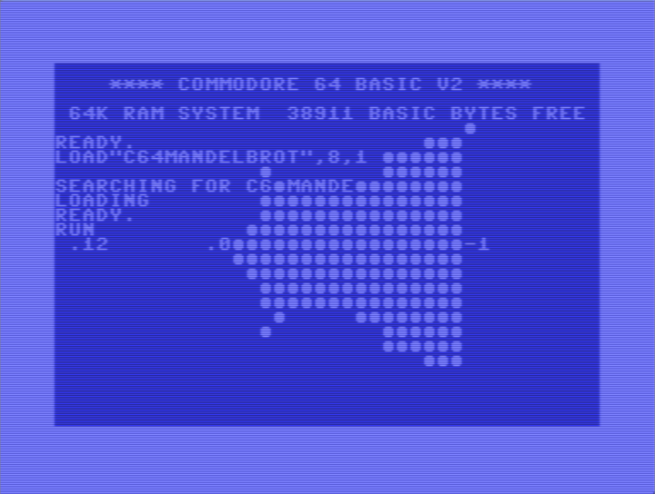
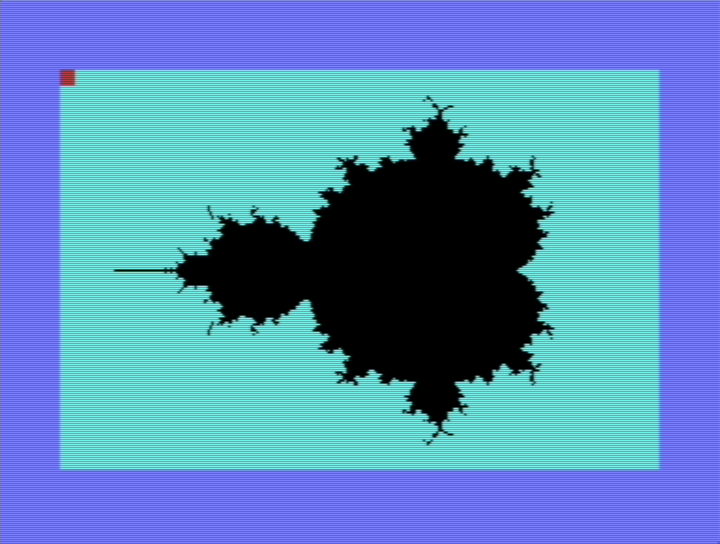

# Mandelbrot Set on the Commodore 64
[:material-arrow-left: Projects](projects.md)

## Overview
My aim is to put my new (...ly acquired) Commodore 64 to the test by rendering out an image of the Mandelbrot set. It also seems like a nice familiar yet non-trivial program to get to grips with BASIC with; one with a few challenges and a satisfying result.

The [Mandelbrot set](https://math.libretexts.org/Bookshelves/Analysis/Complex_Analysis_-_A_Visual_and_Interactive_Introduction_(Ponce_Campuzano)/05%3A_Chapter_5/5.05%3A_The_Mandelbrot_Set) is simply just a set of complex numbers which happen to all satisfy the following condition:

Given some point, $c$, on the complex plane, throw it into the below recursive formula:

$$
\begin{align}
z_{n+1} &= {z_n}^2 + c \\
z_0 &= 0 + 0i
\end{align}
$$

...and see what happens to the value after some $N$ iterations. If that value grows out of control and tends to blow up towards infinity, then it's disqualified; it's not allowed in the set. Conversely, if it remains *bounded*, then it's granted membership status.

While this definition seems completely out of left field and gives the impression that good ol' [Benoit Mandelbrot](https://en.wikipedia.org/wiki/Benoit_Mandelbrot) must have been rather bored at one point, it turns out it allows us to generate all sorts of really fancy images. When plotting this set on the complex plane, we're left with an infinitely detailed and wonderfully complex self-repeating delight. And this is just for one definition of one set. There are oodles out there. For instance, check out [this page](https://paulbourke.net/fractals/sinjulia/) by Paul Bourke for some saliva-inducing visuals using the Julia set which takes the form $z_{n+1}=c\sin{(n_k)}$. Also take a look at [these ones](https://paulbourke.net/fractals/juliaset/index.html) while you're there.

For now, I'll stick with rendering the Mandelbrot set. It's more of a classic: the granddaddy of fractals. 

Note that pixels can either be coloured in a boolean manner(either in the set or out), or they can be gradated in hue or intensity based on the number of iterations they can handle before blowing up to infinity. For now, I'm going with the former approach as it's simpler and means I don't have to deal with the C64's limited colour palate. Did I say "limited"? I meant to say "extensive"; there are a whopping 16 of them to choose from!
## Development
!!! note
	:material-arrow-down: If you want to skip the details, you can go straight to the [output](#running-the-program).

At first, I sat down in front of my breadbin of a C64 to learn how to even use the thing, and to read up on the basics of BASIC. Something about reading the physical manual held in my physical hand, reading physically printed words which were typeset in the early '80s was really satisfying. Some of the lines and arrows were very obviously hand drawn and I'm sure [Letraset](https://hullabaloo.co.uk/blog/whatever-happened-letraset/) was likely used here or there.

Limiting myself to just the one resource in front of me, without googling a whole lot or jumping from site to site every time I needed to learn a new piece of syntax was quite refreshing; it forced me to really *read* the manual and experience the charm dated simplicity.

After tapping away for a while, I decided to chicken out. I powered it down and jumped onto my Windows 11 PC to start developing the program using a modern IDE ([CBM prg Studio](https://www.ajordison.co.uk/index.html)) and emulator ([VICE](https://vice-emu.sourceforge.io/)), for a couple of reasons:

1. A nice modern IDE environment greatly speeds up development with features such as
	1. a usable amount of screen space,
	2. automatic renumbering of lines for easier editing,
	3. and pretty colours.
2. An emulator can instantly be launched and can be sped up, which really brings down the time it takes to test my dodgy code and weed out *all* the bugs.

So putting my finger to 'board, I wrote my first attempt at the program:



Note that this is sped up to about $10\times$ native speed using the emulator's "warp" mode.

This uses the standard screen resolution and filles the character ● for values in the set. This is in the same vein as the [first published image](assets/Pasted%20image%2020250614145340.png). Although I'll admit that this is the wrong shape; I erroneously referenced a variable without realising that it's value had already been re-assigned. 

Speaking of which, the C64 happily handles fractional and negative numbers, but it can't handle complex numbers and so the real and imaginary components of the result have to be split and computed separately. Let's say that $z = x+yi$ and $c=a+bi$:

$$
\begin{align}
z_{n+1} &= {z_n}^2 + c \\
&= (x+yi)^2 + a + bi \\
&= x^2 + 2xyi - y^2 + a + bi \\
&= (x^2-y^2+a) + (2xy+b)i
\end{align}
$$

so for each iteration, the real component becomes $x^2-y^2+a$ and the imaginary component becomes $2xy+b$.

While this character-based iteration of the program works, it's lacking enough resolution to really show off its fractal-like nature. Amongst the many [graphics modes available](https://www.studiostyle.sk/dmagic/gallery/gfxmodes.htm) to the C64 is the `Standard High-Resolution Bit Map Mode` allowing for a $320\times200$ pixel resolution, with each pixel being directly controllable (it can be told what colour it is and whether it's on/off). I think we can all agree that a this'll give a much-needed upgrade to the clarity of the image, greatly contrasting the measly $40\times25$ "pixel" image I've generated so far. 

So I read (skimmed) a few pages from the [graphics manual (1983)](https://www.commodore.ca/manuals/c64_programmers_reference/c64-programmers_reference_guide-03-programming_graphics.pdf), and found that the following commands are essentially what it's all about:

```basic
POKE 53265, PEEK(53265) OR 32   : REM TURN STD BITMAP MODE ON
POKE 53265, PEEK(53265) AND 223 : REM TURN STD BITMAP MODE OFF

REM TURN ON A BIT WITH SOME SCREEN ADDRESS "ADDR"
BIT = 7-(X AND 7) : REM X IS X-COORD, BOTH COORDS CONSIDERED WHEN CALCULATING ADDR
POKE ADDR, PEEK(ADDR) OR 2^BIT
```

A bunch of gibberish to the unfamiliar eye, I know. It's just telling the C64 to set specific values into specific memory locations to toggle the bitmap mode and to set the colours for certain pixels by referencing their address in memory. Calculating the value of the address is more involved, so I'll spare you the details; the manual gives a useful formula.

Putting thumb to key and toggling this hi-res mode on shows this horrifying output:


Notice all the different characters. Unlike the initial low-res image, standard characters can't be used when in this mode. That's because the screen buffer can use the *same memory locations as the character map*; we're literally over-writing the character map with our own pixel values to display to the screen! I find this to be really funky stuff as someone born in 2000 whose first computer ran windows XP. Low level memory mapping like this has never been a part of using a computer up until now. It's kind of *scary* being shown the contents of the computer's raw memory - ready to be naively fiddled with.

Continuing through the manual, I plotted the sinusoid example in appendix [A1](#a1).
## Running the Program
After much pain and gripe (many hours of it), I managed to get some working code on the emulator with an output I was happy with (see [A3](#a3) for a verbatim copy) After typing typing it out and double checking for any mistakes, I entered `RUN` and was graced with the following output!


See [A2](#a2) for a clearer image (emulator screenshot).

Of course this wasn't *instant*... With 3 nested loops and some serious number-crunching, this program isn't cheap for hardware of this age. Especially if the poor C64 running it has to deal with some newbie's un-optimised BASIC for hours on end. As such, the above image took approximately 35-40 hours to render! This corroborates [this](https://www.reddit.com/r/c64/comments/g5ri65/mandelbrot_set_on_the_c64/) Reddit post by Paul Soper (which was partly the inspiration for this project); their code took 36 hours to run.
## Conclusion
This was a fun exercise. It was nice and a little enlightening to use an older machine, it's an honest interaction. The computer is what it is and works how it works and you as the user can do whatever you want with that. 

It was also fun to use BASIC and see the parallels to its modern iterations. I find myself writing Inventor scripts in VBA (out of necessity, not choice) at work. Out of curiosity, I tried to use syntactic features that I'd learned on the C64 and had never seen in a VBA environment such as `REM` and `:`, and they worked in the same way!

In future, when I muster the motivation, I'd like to alter the program to add colour. I could also dip my toes into learning machine language to write a more performant variant. Until then, I'll definitely be playing around a lot more with this fun little machine. 
## Appendix
### A1

/// caption
A sine wave example, directly from the [graphics manual](https://www.commodore.ca/manuals/c64_programmers_reference/c64-programmers_reference_guide-03-programming_graphics.pdf). 
///

### A2

/// caption
Emulated output for `N=15`.
///
### A3
Below is the full program. Note that the magnitude `MG` of each iteration value $z$ is not square rooted (is that a even valid verb?), to save an operation, since it's being compared to some arbitrary integer stand-in for infinity anyway. Not sure how much time that saved, and I don't have the patience to test it...
```basic
10 REM MANDELBROT - BITMAP MODE
20 REM J. PHILBRICK - JUNE 2025

30 BS = 2*4096
40 POKE 53272, PEEK(53272) OR 8  : REM PUT BITMAP AT 8192
50 POKE 53265, PEEK(53265) OR 32 : REM ENTER BIT MAP MODE

60 REM CLEAR BIT MAP AND THEN SET COLOUR
70 FOR I = BS TO (BS + 7999) : POKE I, 0 : NEXT
80 FOR I = 1024 TO 2023 : POKE I, 3 : NEXT
90 POKE 1024, 1

100 MX =  3  : IT = 15 : REM BOUND CEIL & ITER
110 CX = -1  : RX = -1 : REM COL CNT & ROW CNT

120 IU =  1.2 : REM IMAG UPPER
130 IL = -1.2 : REM IMAG LOWER
140 RU =  1.0 : REM REAL UPPER
150 RL = -2.0 : REM REAL LOWER

160 SI = (IU - IL) / 200 : REM IMAG STEP
170 SR = (RU - RL) / 320 : REM REAL STEP

180 FOR R = IL TO IU STEP SI
190 RX = RX + 1 : CX = -1

200 FOR C = RL TO RU STEP SR
210 CX = CX + 1
220 RS(0) = 0 : REM REAL PART RESULT
230 RS(1) = 0 : REM REAL PART RESULT

240 FOR K = 0 TO IT
250 T0 = RS(0)
260 T1 = RS(1)
270 RS(0) = T0^2 - T1^2 + C
280 RS(1) = T0*2 * T1   + R
290 REM ABS MAGNITUDE
300 MG = RS(0)^2 + RS(1)^2
310 IF MG >= MX THEN 420 : END
320 NEXT K

330 REM POKE FILL
340 CH = INT(CX/8)
350 RO = INT(RX/8)
360 LN = RX AND 7
370 BI = 7 - (CX AND 7)
380 BY = BS + RO*320 + CH*8 + LN
390 POKE 1024, 10
400 POKE BY, PEEK(BY)OR(2^BI)

410 GOTO 430
420 POKE 1024, 0
430 NEXT C : NEXT R

440 POKE 1024, 2
450 GOTO 450 : REM INF LOOP TO PAUSE EXECUTION
```