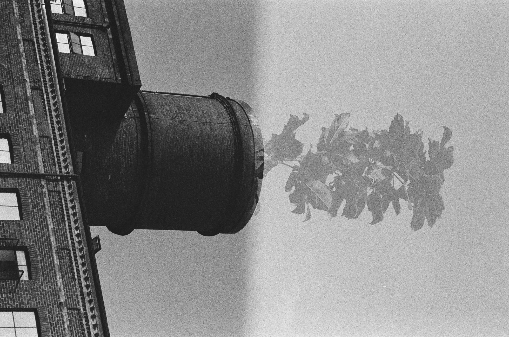

# Double Exposures
[:material-arrow-left: Photography](photography.md)

obsidian://open?vault=personal-site&file=docs%2Fassets%2F451738360019.jpg

{width=400}
/// caption
Reflection of flat building in the river Aire. 
///

{width=400}
/// caption
A picture of the Royal Armouries Museum tower in Leeds, on top of which I exposed some paper cut outs of flying saucers.
///

{width=400}
/// caption
Imaginary friend.
///

{width=400}
/// caption
Plant plot - Bank Mills flats on the river Aire. 
///

{width=400}
/// caption
Camera in place, just rotated 180°. I like the diagonal symmetry. 
///