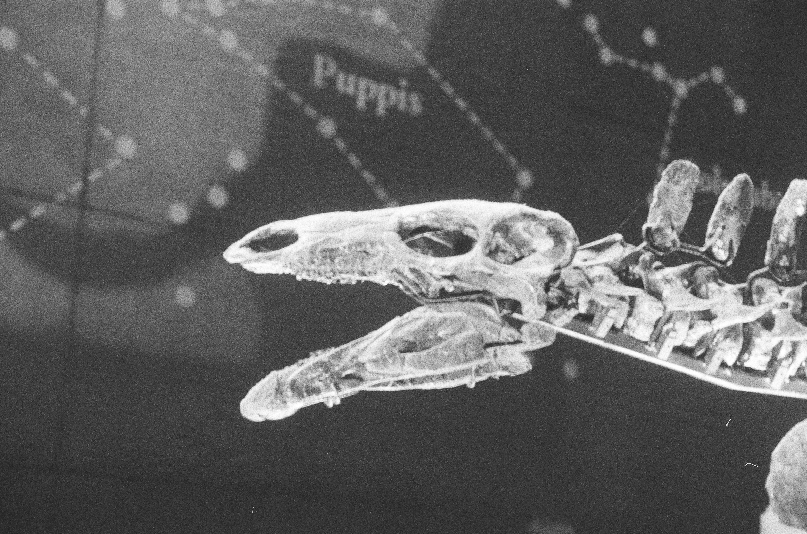
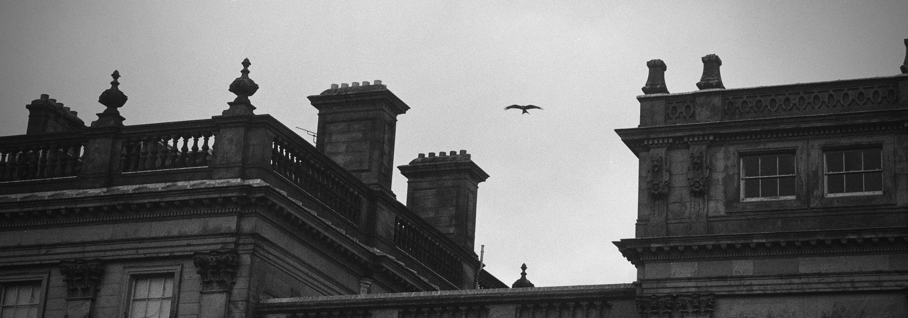
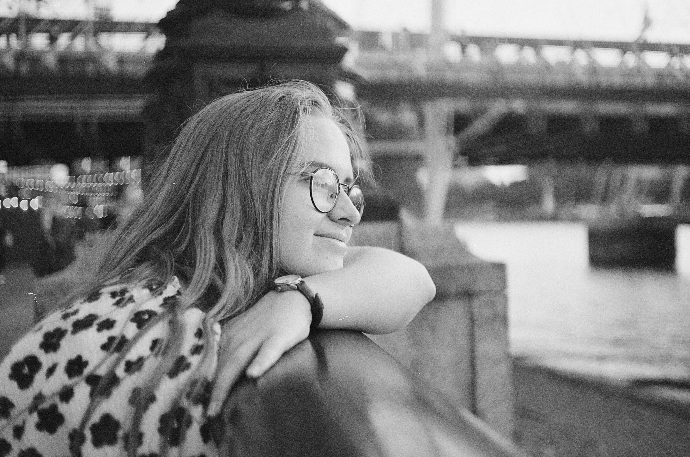

# General/Uncategorised Photography
[:material-arrow-left: Photography](photography.md)
## Gallery - Favourites
{width=400}
///caption
Prague.
///
## Gallery - Film
See some of my [double exposure film photos](photography-film-double-exposures.md). 
{width=400}
///caption
I like the slight glow and retro-futurism of the background. It feels like a still from Jurassic Park, if it were made in the '40s.
///

{width=600}
///caption
Red Kite over Harewood House. 
///

{width=400}
///caption
Abbie on the bank of the Thames. 
///
## Gallery - General
{width=400}
///caption
	Bonfire Night from atop the Rothwell Country Park hill in Leeds.
///

{width=600}
///caption
	[Bucyrus Erie BE 1150 Walking Dragline Excavator](http://www.walkingdragline.org/), situated at RSPB St. Aidans (which used to be an open surface coal mine).
///

{width=400}
///caption
	Aurora visible in Leeds on 10th May 2024.
///

{width=400}
///caption
	A baby lobster sitting in a tray in the [Whitby Lobster Hatchery](https://whitbylobsterhatchery.co.uk/). Its claw was ripped off at some point, but fret not, it'll grow back. 
///