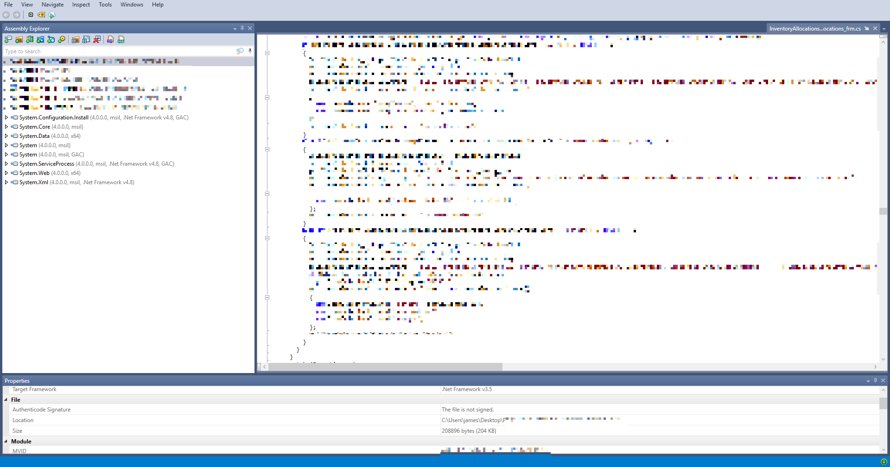
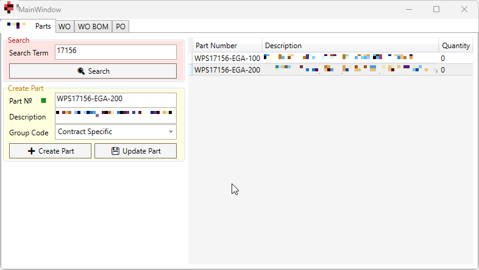

# Creating Part Numbers via Reverse Engineering
[:material-arrow-left: Projects - Engineering](projects-engineering.md)
## Summary of the Problem
At the time of writing (May 2025), the company I work for uses a production control software to, among other things, manage the company's part inventory. For the sake of anonymity, lets call this software *Advancement Systems*. As a member of the engineering team, I frequently need to create and update parts to reflect my contract-specific arrangements and designs.

The issue is that we have a finite number of floating licenses (<30) for a company which currently has circa 200 employees, many of whom need access to the system. As such, logging on can be difficult and time consuming; I usually need to ask around for someone to temporarily log off to open up a space.
## Reverse Engineering a Solution
My usage requirements of the system are very limited. Most of the time, I'm following the standard CRUD operations below:

- Creating new part entries (number & description pair),
- querying to see if certain parts exist, and obtaining their descriptions to be used in other areas of work, and
- updating my part descriptions to reflect design changes.

All of the functionality I need can be encapsulated as simple reads, writes, and edits to and from the company database that the *Advancement Systems* applications is linked to.

So, having access to the applications source files, I used [Jetbrains dotPeek](https://www.jetbrains.com/decompiler/) to decompile the source code and reverse engineer its interaction with the database. 

/// caption
The dotPeek interface displaying decompiled source code. All code and identifying information has been blurred out. 
///

After a couple of evenings of surfing through a seemingly infinite number of obscurely-named classes, I was able to reconstruct all of the database interaction logic which, in addition to basic SQL read and write commands, also logged changes and called additional SQL scripts that I had not previously known about.

I then rewrote this functionality as a standalone C# tool: 

While I was at it, I also added some additional functionality such as querying additional purchase order information. 
## Conclusion
My application vastly reduces reliance on *Advancement Systems* application to get my work done, which in turn curtails time wasted trying to get access when all the floating licenses are checked out to other colleagues. 

I learnt a lot developing it and reverse engineering its requirements. I use it on a daily basis and every time I do, I get rewarding with a personal sense of satisfaction. 