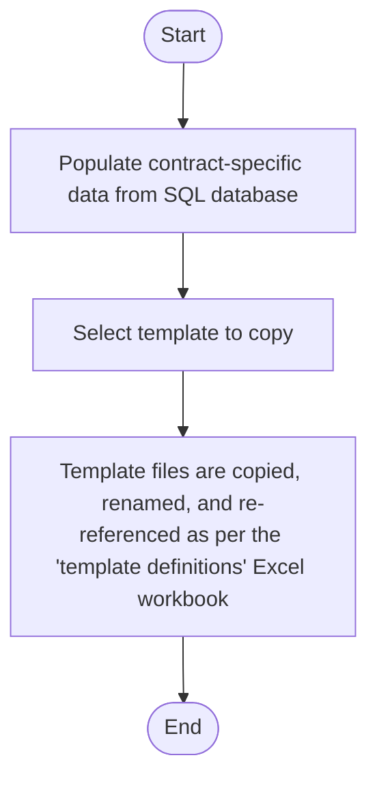

# Inventor Templates Manager Application
[:material-arrow-left: Projects - Professional](projects-professional.md)
## Overview
Both myself and my colleagues find ourselves designing and adapting a lot of contract-specific CAD arrangements to suit different customer requirements. Each arrangement is an Inventor assembly file which gets added to a larger transformer assembly. To do this efficiently, we have a collection of template parts, assemblies, and drawings located on a shared drive. The necessary files used to be copied over to a contract-specific folder and manually re-linked. This manual process had problems:

- The correct files to copy had to be manually located and moved, which took time.
- Re-referencing the correct parts to the newly-copied contract-specific assembly was tedious and error-prone; leaving a link to a template part in a contract-specific assembly is *not good*, and sometimes changes would propagate to completely unrelated contracts. 

This project was a response to these problems. The aim was two-fold: 

1. To allow for template files to be copied over automatically, with all references to parts/subassemblies being updated accordingly. In some cases, the time saved is significant - 20m vs 30s in some cases. This also removes any chance of human error from the equation. 
2. To allow for templates to be added and updated by anyone in the team, with very little configuration or technical knowledge of how the program works. 

So I wrote the following desktop application to be used by all members of the Engineering department:

## Usage
The general usage is simple:

The `template definitions.xlsx` sheet is a shared Excel workbook which simply defines the files, locations, and actions that make up each template:

Each template has its own sheet wherein each row represents each file. The `FROM` column is where the template file is located, and the `TO` column states where it should be copied and how it should be renamed. The `ACTION` column then defines an action to be done to that file after it has been copied (e.g. populating data into the border block of a drawing). 

These paths use a set of custom *tokens* in square brackets (e.g. `[SO]` and `[N]` as in the above screenshot). These are replaced with contract-specific data when the file is copied over. These tokens are of course custom to the folder and internal part numbering (IPN) rules that the department/company uses. 

Creating a new template is simply a matter of creating a new sheet and populating a row for each template file. That's it! No scripting required. The new template will then automatically appear in the application for all users. 
## A Simplified Example
Let's say I have a template with 2 parts: `MyPart1.ipt` and `MyPart2.ipt`. These combine together to form `MyAssembly.iam` which is displayed in `MyDrawing.idw`. And let's say that contract number `12345` requires an altered version of this template: `MyAssembly-12345.iam`. 

Assuming there is a `[contract]` token set up, my `Template Definitions.xlsx` file will look like:

| From                          | To                                            | Action (drop down)                  |
| ----------------------------- | --------------------------------------------- | ----------------------------------- |
| SomeSourcePath/MyPart1.ipt    | SomeDestinationPath/MyPart1-[contract].ipt    |                                     |
| SomeSourcePath/MyPart2.ipt    | SomeDestinationPath/MyPart2-[contract].ipt    |                                     |
| SomeSourcePath/MyAssembly.iam | SomeDestinationPath/MyAssembly-[contract].iam | Reference Files                     |
| SomeSourcePath/MyDrawing.idw  | SomeDestinationPath/MyDrawing-[contract].idw  | Reference Files and Populate Border |

I then just run the application and modify the resulting `MyAssembly-12345`. I can then export the drawing and I'm done!
## Conclusion
While this system works for now, it'll need to be revised if there are any updates to file naming or IPN conventions. This was a temporary solution to increase departmental efficiency prior to our department getting Autodesk Vault, which may render its use void. That being said, it gets used every day by and I'd estimate it saves ±2 hrs per week (total, over 4 engineers). At a median hourly labour rate of £65, that's equivalent to $2 \times 65 \times 48 = £6240/\text{year}$. While it's hard to know the exact quantitative pecuniary impact, it's qualitative influence is definitely tangible. In my opinion, the success of this project boils down to the fact that it forces everyone to use the same standardised templates. Periodic improvements and adjustments are instantly seen and used by all users.

I hope you found this interesting! :smiley: I had loads of fun doing it and I learnt a lot in the process. 

For more work I've done with automating Inventor workflows, see [projects-professional](projects-professional.md).
## Further Information
The program is a [WPF](https://learn.microsoft.com/en-us/dotnet/desktop/wpf/overview/) application written in C#. It runs natively on all windows machines in the office with no further dependencies other than Excel, Inventor, and access to the company SQL database. It logs all actions and includes descriptive error handling. Its performance is bottlenecked by the speed of the Excel interop API and the speed at which Inventor can load assemblies and drawings. 