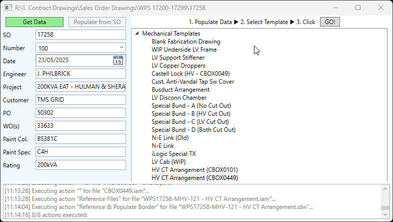
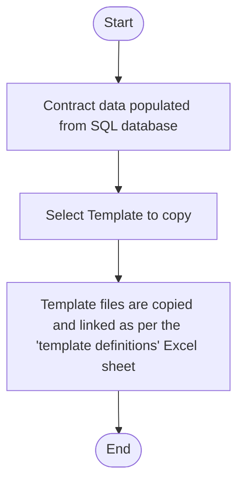
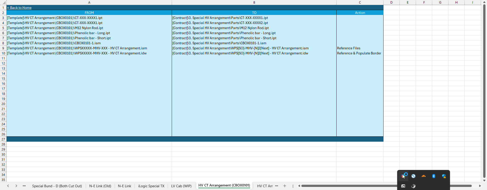
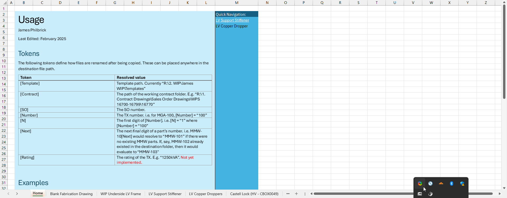

# Inventor Templates Manager Application
[:material-arrow-left: Projects - Professional](projects-professional.md)
## Overview
Both myself and my colleagues find ourselves designing and adapting a lot of contract-specific CAD arrangements to suit different customer requirements. Each arrangement is an Inventor assembly file which gets added to a larger transformer assembly. To do this efficiently, we have a collection of template parts, assemblies, and drawings located on a shared drive. The necessary files used to be copied over to a contract-specific folder and manually re-linked. This manual process had problems:
- The correct files to copy had to be manually located and moved, which took time.
- Manually referencing the correct parts to the newly-copied contract-specific assembly was tedious and error-prone; leaving a link to a template part in a contract-specific assembly is *not good*, and sometimes changes would propagate to completely unrelated contracts. 

The aim of this project was two-fold: 
1. To allow for templates to be copied over automatically, with all references to parts/subassemblies being updated. In some cases, the time saved is significant - 20mins vs 30s, while removing any chance of human error from the equation. 
2. To allow for templates to be added and updated by anyone in the team, with very little configuration or technical knowledge of how the program works. 

So I wrote the following desktop program to be used by all members of the Engineering dept.:

I won't go into detail about it's usage, but the general process is as follows: 

The `template definitions` sheet mentioned above is a shared Excel workbook which simply defines the files, locations, and actions that make up each template:

